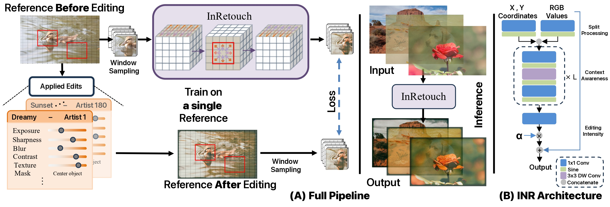
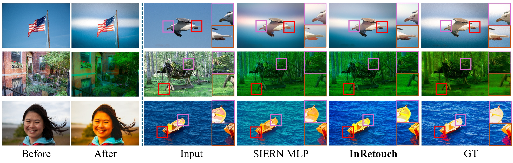
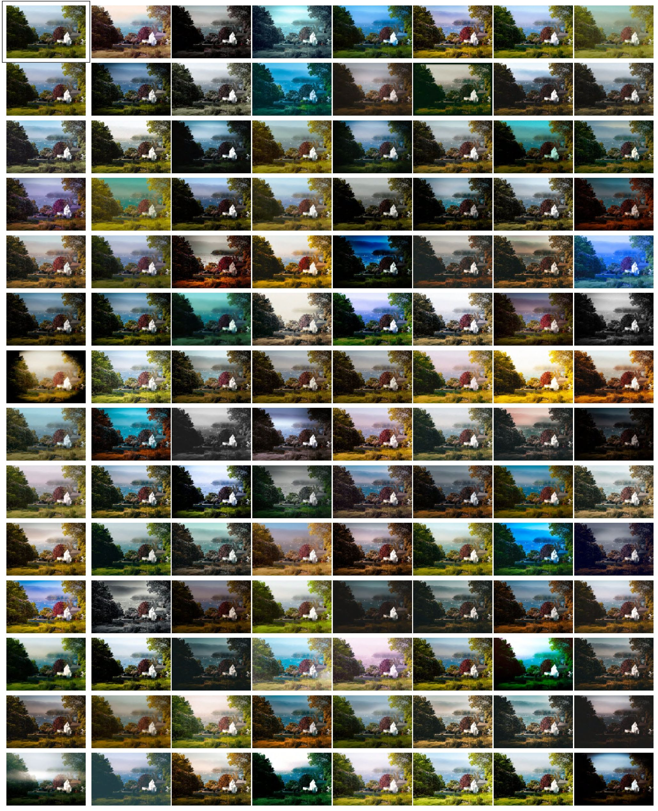

# InRetouch - WACV 2026


### INRetouch: Context Aware Implicit Neural Representation for Photography Retouching

#### [Omar Elezabi](https://scholar.google.com/citations?user=8v3dYzEAAAAJ&hl=en), [Marcos V. Conde](https://mv-lab.github.io/), [Zongwei Wu](https://sites.google.com/view/zwwu/accueil), and [Radu Timofte](https://scholar.google.com/citations?user=u3MwH5kAAAAJ&hl=en&oi=sra)

#### **Computer Vision Lab, University of Würzburg, Germany**

[](https://www.arxiv.org/abs/2412.03848)
[](https://omaralezaby.github.io/inretouch/)
[](https://huggingface.co/datasets/omaralezaby/Retouch_Transfer_Dataset)

<a href="https://omaralezaby.github.io/inretouch/"></a>

## Latest
- `11/12/2025`: Full code & Dataset release.
- `11/11/2025`: Our work got accepted at WACV 2026!🎉

## Method
<br>
<details>
  <summary>
  <font size="+1">Abstract</font>
  </summary>
Professional photo editing remains challenging, requiring extensive knowledge of imaging pipelines and significant expertise. While recent deep learning approaches, particularly style transfer methods, have attempted to automate this process, they often struggle with output fidelity, editing control, and complex retouching capabilities. We propose a novel retouch transfer approach that learns from professional edits through before-after image pairs, enabling precise replication of complex editing operations. We develop a context-aware Implicit Neural Representation that learns to apply edits adaptively based on image content and context, and is capable of learning from a single example. Our method extracts implicit transformations from reference edits and adaptively applies them to new images. To facilitate this research direction, we introduce a comprehensive Photo Retouching Dataset comprising 100,000 high-quality images edited using over 170 professional Adobe Lightroom presets. Through extensive evaluation, we demonstrate that our approach not only surpasses existing methods in photo retouching but also enhances performance in related image reconstruction tasks like Gamut Mapping and Raw Reconstruction. By bridging the gap between professional editing capabilities and automated solutions, our work presents a significant step toward making sophisticated photo editing more accessible while maintaining high-fidelity results.
</details>



## Results
<br>
<details>
  <summary>
  <font> Transfer retouches from professionally edited images collected online.</font>
  </summary>
  <p align="center">
  
  </p>
</details>

<br>
<details>
  <summary>
  <font> Comparison between different methods on retouching transfer Benchmark. </font>
  </summary>
  <p align="center">
  
  </p>
</details>

<br>
<details>
  <summary>
  <font>  Importance of context awareness for local and region specific modifications. </font>
  </summary>
  <p align="center">
  
  </p>
</details>

## Retouch Transfer Dataset (RTD)

We propose RTD, a comprehensive Photo Retouching Dataset comprising 100,000 high-quality images edited using 170 professional Adobe Lightroom presets. The full dataset can be downloaded from the [link](https://huggingface.co/datasets/omaralezaby/Retouch_Transfer_Dataset). We utilized 569 images from MIT5K to create the dataset. For the benchmark, we set aside 61 images and 22 presets. Neither the images nor the presets used for the benchmark are utilized for training.

<details>
  <summary>
  <font> Visualization of the variety of edits dataset. </font>
  </summary>
  <p align="center">
  
  </p>
</details>


## Install
Download this repository
````
git clone https://github.com/omarAlezaby/InRetouch.git
cd InRetouch
````
Create a conda enviroment and install the dependencies:
````
conda create -n inretouch python=3.10
conda activate inretouch
conda install pytorch==2.4.0 torchvision==0.19.0 torchaudio==2.4.0 pytorch-cuda=12.1 -c pytorch -c nvidia
pip install -r requirements.txt
````

## Usage
Train INR to create a neural representation to the edits from the given example.
You need to have at least one example of Before / After image editing to optimize the INR. After the INR optimization, you can utilize it to apply the same edits to new images to achieve the same look in the optimization example.


### **Learning Edits From an Example**
#### **Single Example**
Update the location of the example (Before - After Editing) in the config file `options/train/InRetouch_Optimize_Single.yml`, then run the following command to optimize the edits INR. 
  `````
  python basicsr/train_INR.py -opt options/train/InRetouch_Optimize.yml
  `````
#### **Muiple Examples**
The code also supports multiple examples for the same style for better accuracy. Please add corresponding Before / After Editing images in the same order in `options/train/InRetouch_Optimize_Multiple.yml`. Run the following command to optimize the edits INR.
`````
  python basicsr/train_INR.py -opt options/train/InRetouch_Optimize_Multiple.yml
`````

### **Inference**
Update the config file `options/test/INR_Inference.yml` with the inferece images folder. Run the following command for inference. 
`````
  python basicsr/test.py -opt options/test/INR_Inference.yml
`````
For video inference update `options/test/INR_Video.yml` with the inference video location. Run the following command for video inference. 
`````
  python basicsr/test_video.py -opt options/test/INR_Video.yml
`````

### **Evaluation - RTD Benchmark**

To evaluate our method on the Retouch Transfer Benchmark, please download the `Benchmark` from this [link](https://huggingface.co/datasets/omaralezaby/Retouch_Transfer_Dataset), move it to `dataset` folder, and run the following command.
`````
  python basicsr/RTD_Benchmark.py -opt options/train/InRetouch_RTD_Benchmark.yml
`````
For each input image, we use a fixed reference for consistent comparison. References can be found in `references_file.txt` in the Benchmark.

## Citation

If you find our work helpful, please consider citing the following paper and/or ⭐ the repo.
```
@article{elezabi2024inretouch,
  title={INRetouch: Context Aware Implicit Neural Representation for Photography Retouching},
  author={Elezabi, Omar and Conde, Marcos V and Wu, Zongwei and Timofte, Radu},
  journal={arXiv preprint arXiv:2412.03848},
  year={2024}
}      
```


### Contacts

For any inquiries contact<br>
Omar Elezabi: <a href="mailto:omar.elezabi@uni-wuerzburg.de">omar.elezabi[at] uni-wuerzburg.de</a><br>
Marcos V. Conde: <a href="mailto:marcos.conde@uni-wuerzburg.de">marcos.conde [at] uni-wuerzburg.de</a>

## Acknowledgements

The code is built on [NAFNet](https://github.com/megvii-research/NAFNet).

## License

Copyright (c) 2025 Computer Vision Lab, University of Wurzburg

Licensed under CC BY-NC-SA 4.0 (Attribution-NonCommercial-ShareAlike 4.0 International); you may not use this file except in compliance with the License.
You may obtain a copy of the License at

https://creativecommons.org/licenses/by-nc-sa/4.0/legalcode

The code is released for academic research use only. For commercial use, please contact Computer Vision Lab, University of Würzburg.
Unless required by applicable law or agreed to in writing, software distributed under the License is distributed on an "AS IS" BASIS, WITHOUT WARRANTIES OR CONDITIONS OF ANY KIND, either express or implied.
See the License for the specific language governing permissions and limitations under the License.

